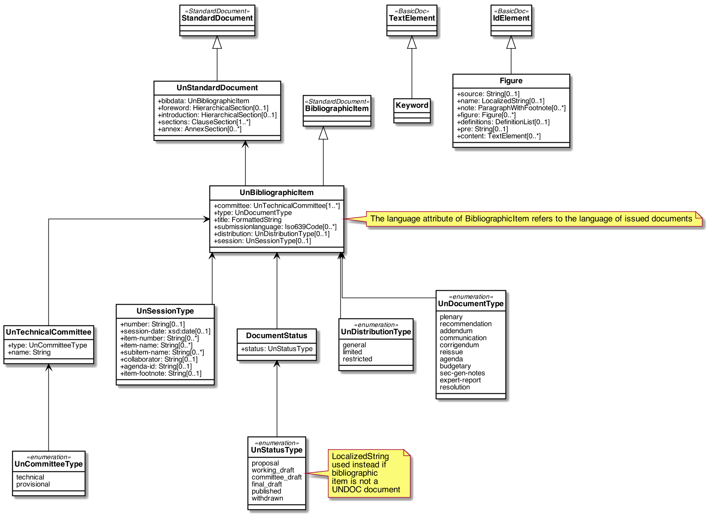

= Metanorma UNDOC Models

This is where we keep the Metanorma UNDOC model definitions.

The UNDOC Standard Document format is an instance of the
https://github.com/metanorma/metanorma-model-standoc[Metanorma StandardDocument model].
Details of the general model can be found on its page.

== UNDOC Standard Document Model

